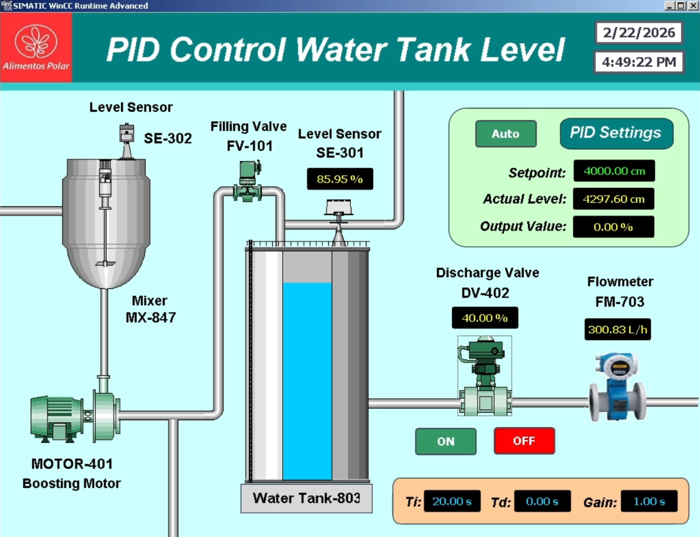

# PID Control Water Tank Level Simulation with Tia-Portal PLC, HMI, SCADA

## PID Control Water Tank Level Simulation with Tia-Portal PLC, HMI, SCADA

## Preview

- Dashboard Preview: https://youtu.be/hWPOaEmfamw?si=fjdIVacudmMIUGcw

## Connect
- Linkedin: https://www.linkedin.com/in/luis-jose-mendez/
- GitHub: https://github.com/mendez-luisjose
